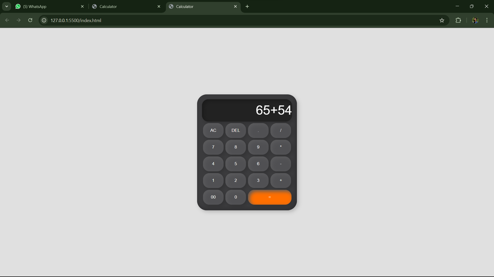

# 🔢 Calculator Web Application

A simple yet beautifully styled calculator built using **HTML**, **CSS**, and **JavaScript**. This project showcases a functional and responsive calculator UI with all basic arithmetic operations.

## 📸 Preview

> 💡 You can add a screenshot of the calculator in the same folder and name it `preview.png` for the above image to show up.

---

## 🚀 Features

- 🧮 Perform basic arithmetic operations: `+`, `-`, `*`, `/`
- 🔁 Clear all (`AC`) and delete last character (`DEL`)
- ✅ Evaluate expressions with `=`
- 🔢 Styled numeric and operator buttons
- 🎨 Neumorphic UI design using CSS

---

## 🛠️ Technologies Used

- **HTML** – For structure
- **CSS** – For layout and styling
- **JavaScript** – For calculator logic and interactivity

---

## 📂 File Structure
├── index.html # Main HTML structure
├── style.css # Styling for the calculator
├── preview.png # Optional screenshot (add manually)

---

## 🧠 How It Works

- The user inputs numbers or operators using buttons.
- JavaScript handles button clicks and updates the input field.
- When `=` is clicked, the `eval()` function computes the result.
- `AC` clears the entire input, while `DEL` removes the last character.

---

## 🖥️ How to Run

1. Clone or download the repository.
2. Open `index.html` in any browser.
3. Start calculating!

---

## 📌 Note

This project uses `eval()` to evaluate expressions, which is suitable for small apps but should be avoided in production apps due to security risks.

---

## 💡 Future Enhancements

- Add keyboard support 🧑‍💻  
- Add scientific functions (sin, cos, tan, etc.) 🧮  
- Add light/dark mode toggle 🌗

---

## 🙌 Made with ❤️ by Akalya S T

